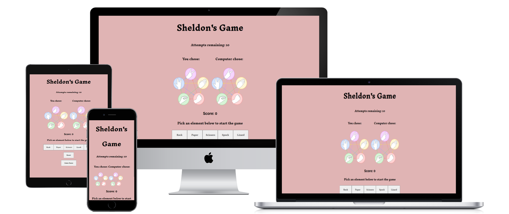
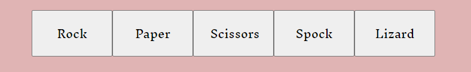
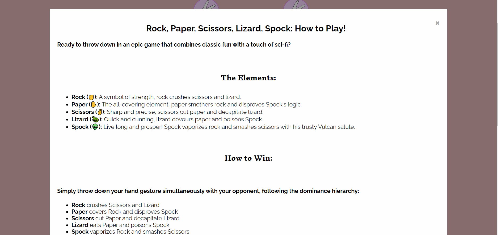
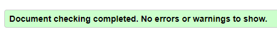

# Sheldon's Game

* Appearing in the TV Show, the Big Bang Theory, this novel twist on the classic game of Rock, Paper, Scissors adds two new elements of Lizard and Spock.
* In this game the user will be able to choose between the five elements as they attempt to beat the computer which is selecting at random.
* The user has 10 attempts to best the computer

## Features

### Existing features

#### Header
* Placed at the top of the page, this feature clearly states to the user what they are playing.
* This heading is displayed in a playful font, clearly visible against the background.

#### Game Area
* This section displays the number of attempts remaining, and the element that the user and computer have chosen in this game.
* When the game is first loaded and after the reset button is pressed a photo of all elements are displayed and 10 attempts will be remaining.
* When an element is selected by the user it is displayed under the heading "You chose", simultaneously the computer's choice is displayed under the "Computer Chose" heading.
* With each selection that the user makes the attempts will decrease.

#### Results
* Score and game message is displayed, reflecting the changes in score in each event.
* When the game is first loaded and after the restet button is pressed, the score is set to 0 and a starting message is displayed.

#### Element Selection
* Five buttons are displayed side by side horizontally.
* These buttons outline the choices available to the player.
* Clicking any of these five buttons confirm the players choice and starts the game.
* Upon starting the game the computers choice will also be displayed and so will an outcome message and an update to the score.

#### Reset Button
* When the user wishes to start the game over, this reset button is available instead of needing to use the refresh button on the webpage.
* When this button is clicked the score returns to 0 and any outcome message currently displayed will disappear.

#### Game Rules Modal
* This feature allows users to understand the rules of the game they are playing.
* In an attempt to save screen space this feature is collapsable and only appears when clicked, it also disappears when clicked again.
* Included in this section is a description of the game elements, the hierarchy existing between these elements and some basic tips and tricks for the user.

### Features left to implement
* Additional features I will consider implementing in the future are:
    * Adding a multiplayer function where two people can play against each other
    * Developing on the rounds function to add more layers
    * Add an additional game message with more description

## Testing

### Basic Testing
* I tested this game on Chrome, Edge, Safari and it worked on all of them
* I checked the display of this game on all Phone screens and it displays well
* I confirmed that the text, elements and background all contrast each other enough and are visibile.
* I passed it through Lighthouse Dev Tools

### Bugs
* A bug I faced was the `determineWinner()` function not working in Javascript:
    * When first creating this function I gave it two inputs of `(choices[userChoice], choices[computerChoice])`.
    * My initial rationale behind this was due to choices being an array, and userChoice/computerChoice both being numerical inputs 
    indicating which of the array was selected that I needed both for the function to work.
    * However the `choices` array was declared as a global const and is accessible throughout functions, 
    so I was able to exclude this in the input which was now `(userChoice, computerChoice)`.
    * After making this change I was able to simply call `choices` whenever I needed it in the function. 

### Validator Testing
* No errors appeared while using the W3 HTML Validator

* No errors appeared while using the W3 CSS Validator

## Deployments
* I deployed this website to github pages following the below steps
    * In the GitHub repository, navigate to the Settings tab
    * From the source section drop-down menu, select the Master Branch
    * Once the master branch has been selected, the page will be automatically refreshed with a detailed ribbon display to indicate the successful deployment
* The live link can be found here: https://abdullahalsehaim.github.io/Sheldons-Game/

## Credits

### Content
* Used [W3 Schools](https://www.w3schools.com/howto/howto_css_modals.asp) to create Modal Feature.
* Used [W3 Schools](https://www.w3schools.com/html/html_emojis.asp) to add Emojis to text section of Modal.

### Media
* Used image of all elements from [Big Bang Theory Wiki](https://bigbangtheory.fandom.com/wiki/Rock,_Paper,_Scissors,_Lizard,_Spock).
* Took images of individual elements from [PNGWNG](https://www.pngwing.com/en/free-png-ycasl).
* Learned how to use the `setTimeout()` function from [BYBY.Dev](https://byby.dev/js-wait-n-seconds)

### Acknowlegdements
* Javascript Code was taken from Code Institute's Rock, Paper, Scissors Game and Maths Game.
* My mentor, Medale Oluwafemi, for his invaluable guidance.